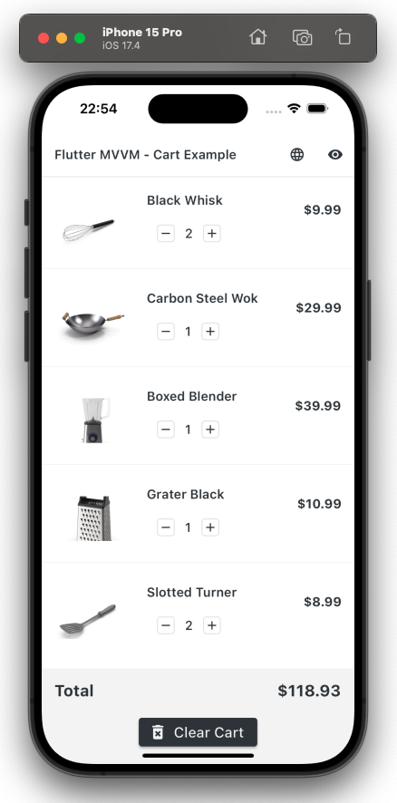
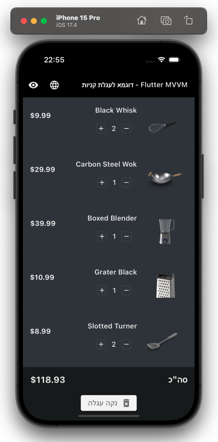

# Flutter MVVM Starter Project

This project is a starter Flutter application that implements the Model-View-ViewModel (MVVM) architecture with a Cart feature as an example. It is designed to demonstrate best practices in Flutter app development, including multi-language support, theme management, state management, basic environment configuration, HTTP networking, exception handling and unit testing.

## Preview

| Light Theme with English Layout | Dark Theme with Hebrew Layout |
|:-------------------------------:|:-----------------------------:|
|  |  |

## Getting Started

To get started with this project, ensure that you have Flutter installed on your machine. If you haven't installed Flutter yet, follow the installation guide on the [Flutter official documentation](https://docs.flutter.dev/get-started/install).

### Prerequisites

- Flutter SDK

- Visual Studio Code or Android Studio with Flutter and Dart plugins installed

- An iOS simulator/Android emulator installed on your machine OR connected physical device to run the app

### Installation

1. Clone the repository to your local machine:

```sh
git clone https://github.com/aviperetz91/flutter_mvvm_starter_project.git
```

2. Navigate to the project directory:

```sh
cd flutter_mvvm_starter_project
```

3. Get all the dependencies:

```sh
flutter pub get
```

4. Run the app:

```sh
flutter run
```

## Features

- Multi-Language Support
- Theme Management
- State Management Using Provider
- Basic Environment Configuration
- HTTP Networking Using Dio
- Exception Handling
- MVVM Architecture
- Unit Testing

## Build

- For Android:

```sh
flutter build apk --release
```

This command is used to build a release version of your app in APK format for Android devices.

- For iOS:

```sh
flutter build ios --release
```

This command prepares a release build of your app for iOS devices. Before running this command for iOS, you need to ensure that you have a valid iOS development environment set up, including Xcode and the necessary provisioning profiles.

## License

Distributed under the MIT License. See `LICENSE` for more information.

## Acknowledgements

- [Flutter Documentation](https://docs.flutter.dev/)

- [Dart Documentation](https://dart.dev/guides)

- [Shared Preferences](https://pub.dev/packages/shared_preferences)

- [Provider Package for State Management](https://pub.dev/packages/provider)

- [Dio Package for HTTP requests](https://pub.dev/packages/dio)

- [Pretty Dio Logger for HTTP request logging](https://pub.dev/packages/pretty_dio_logger)

## Contact

Avi Peretz

- Linkedin: [https://www.linkedin.com/in/avi-peretz-778ba6177/](https://www.linkedin.com/in/avi-peretz-778ba6177/)
- Email: aviprz91@gmail.com

Project Link: [https://github.com/aviperetz91/flutter_mvvm_starter_project](https://github.com/aviperetz91/flutter_mvvm_starter_project)
